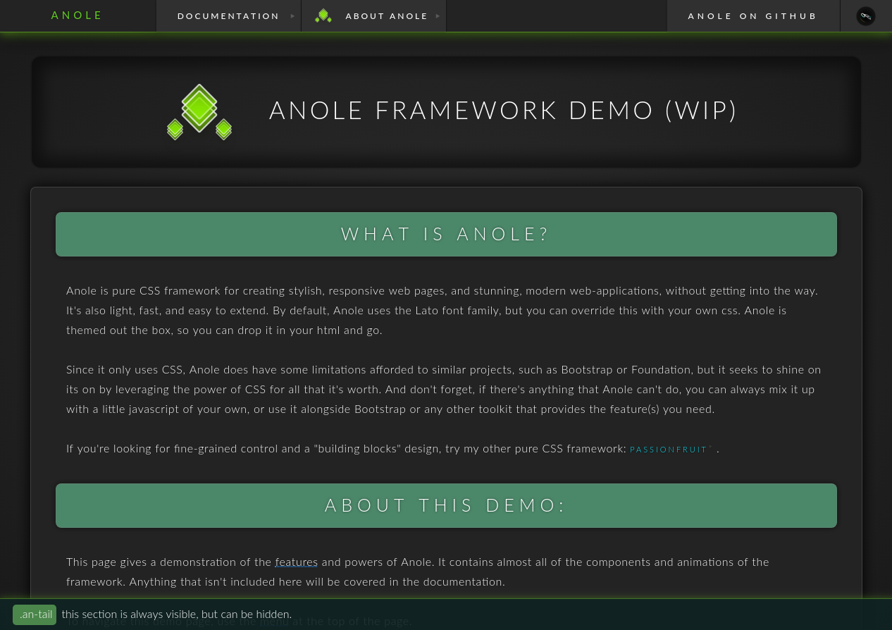

# Anole
A CSS framework for creating websites that adapt to their environment like an Anole.

## Structure:
- A single css file, anole.css, will provide everything you need to get started.
- Themes will be possible, using anole-themename.css to override or extend existing classes.

A website using Anole will consist of three main "parts" or areas:

- **Head:** always visible. Recommended for navigational content.
- **Body:** sits below the head, centered on the page. Recommended for main content.
- **Tail:** optional, recommended for author info and links. Can optionally replace the head, to be used for navigation.

## Requirements:
- Lato fonts (might be included). Required for default theme, other themes may use other fonts.
