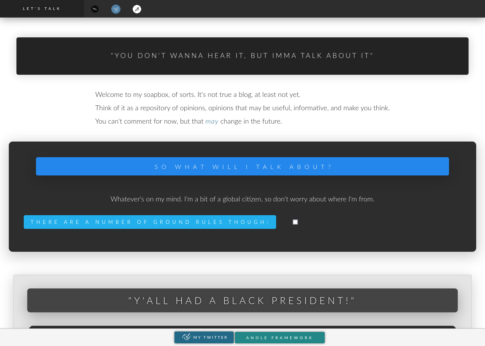

# Anole
A pure CSS framework for creating websites that adapt to their environment, much like the [Anole lizards](https://en.wikipedia.org/wiki/Dactyloidae) have done throughout their range. Designed originally as an personal experiment, meant to see what was possible using CSS alone, Anole has since evolved into a robust framework of its own. It utilizes the power of features of CSS3, such as Flexbox and CSS Custom Properties (variables). Primarily class-driven, Anole is not pushy, and will not attempt to style anything unless asked.

# Real World Examples:

## Anole Official Website: [https://rolandixor.pro/anole](https://rolandixor.pro/anole)

## Let's Talk - by Roland Taylor: [Let's Talk](https://rolandixor.pro/letstalk)

## Spirit And Truth Ministries: [sptmin.com](https://sptmin.com)

## Grace Rain - "Listen Online": [View Here](https://sptmin.com/gracerain/listen)

## Iguana - CSS Image Filter Library

## The Somewhat Wise Sayings Of Roland Taylor

## Structure:
- A single css file, anole.css, will provide everything you need to get started.

A website using Anole typically consists of three main areas:

- **.an-head:** always visible. Recommended for navigational content.
- **.an-body:** sits below the head, centered on the page. Recommended for main content.
- **.an-tail:** optional, recommended for author info and links. Can optionally replace the head, to be used for navigation.

## Requirements:
- Lato fonts (will soon be replaced with Google Fonts).
